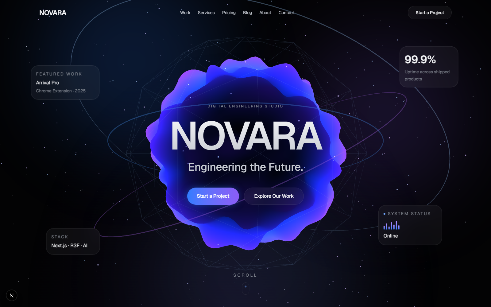

<div align="center">

# NOVARA

**Engineering the Future.**

A digital engineering studio portfolio — built with Next.js 16, React 19, and React Three Fiber. Cinematic 3D hero, scroll-driven storytelling, and full case-study, blog, and pricing systems.

[](https://portfolio-eight-pied-11.vercel.app/)
[](https://github.com/MdShohag07/portfolio)

</div>

<br />



<br />

## Overview

NOVARA is a fictional digital engineering studio used as a showcase portfolio. The site pairs a WebGL-driven hero (React Three Fiber + custom shader material) with GSAP/Framer Motion scroll storytelling, MDX-powered blog posts, and dynamic per-route SEO metadata — the kind of production polish a real client-facing studio site ships with.

**[→ View the live site](https://portfolio-eight-pied-11.vercel.app/)**

## Highlights

- 🌌 **3D animated hero** — a shader-based blob rendered with `@react-three/fiber` + `@react-three/drei`, orbiting wireframe rings, and live floating stat cards
- 🧭 **Scroll storytelling** — GSAP and Framer Motion drive homepage section reveals and a mobile drawer nav
- 📄 **Full site surface** — Home, Work (case studies), Services, Pricing, Blog (MDX), About, Contact, and a Design System reference page
- 🔎 **SEO-complete** — per-route metadata, dynamic OG image generation, dynamic favicon/icon, `robots.ts`, and `sitemap.ts`, all sourced from a single `site-config`
- 🎨 **Design system** — shared UI primitives (`field`, form components) and a dedicated `/design-system` page documenting them
- ⚡ **Modern stack** — Next.js 16 (App Router), React 19, TypeScript, Tailwind CSS 4

## Tech Stack

| Layer | Tools |
|---|---|
| Framework | [Next.js 16](https://nextjs.org) (App Router), [React 19](https://react.dev) |
| 3D / Motion | [React Three Fiber](https://docs.pmnd.rs/react-three-fiber), [drei](https://github.com/pmndrs/drei), [Three.js](https://threejs.org), [GSAP](https://gsap.com), [Framer Motion](https://www.framer.com/motion/), [Lenis](https://github.com/darkroomengineering/lenis) (smooth scroll) |
| Styling | [Tailwind CSS 4](https://tailwindcss.com), `class-variance-authority`, `tailwind-merge` |
| Content | [MDX](https://mdxjs.com) via `@next/mdx` for blog posts |
| Language | TypeScript |
| Deployment | [Vercel](https://vercel.com) |

## Pages

```
/                      Home — 3D hero, storytelling sections, footer
/work                  Case study index
/work/[slug]           Individual case studies (Arrival Pro, Clean Home Kuwait, The Dining Lounge)
/services              Service offerings
/pricing               Pricing tiers
/blog                  Blog index (MDX posts)
/about                 Studio / about page
/contact               Contact form
/design-system         UI component reference
```

## Getting Started

```bash
# install dependencies
npm install

# run the dev server
npm run dev
```

Open [http://localhost:3000](http://localhost:3000) to view it locally.

```bash
npm run build   # production build
npm run start   # serve the production build
npm run lint    # lint the codebase
```

## Project Structure

```
src/
├── app/                  # Next.js App Router routes
│   ├── work/[slug]/      # Dynamic case study pages
│   ├── blog/             # MDX blog posts + layout
│   ├── icon.tsx          # Dynamic favicon
│   ├── opengraph-image.tsx
│   ├── robots.ts
│   └── sitemap.ts
├── components/           # UI, blog, and contact-form components
└── lib/
    ├── site-config.ts    # Single source of truth for site metadata
    └── metadata.ts        # Per-route metadata generation
```

## Deployment

The project is deployed on [Vercel](https://vercel.com) and live at **[portfolio-eight-pied-11.vercel.app](https://portfolio-eight-pied-11.vercel.app/)**.

---

<div align="center">
<sub>Built by <a href="https://github.com/MdShohag07">Shohag Mia</a></sub>
</div>
